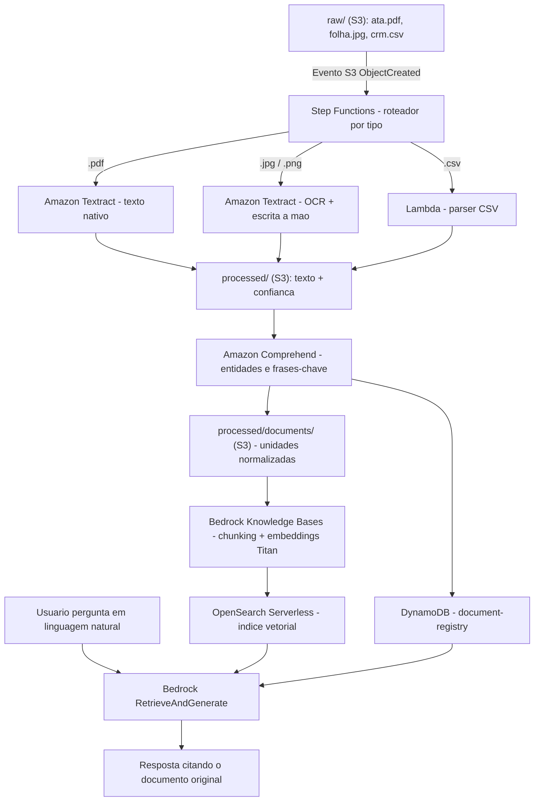

# Desafio: Wiki Inteligente de Conhecimento da Empresa na AWS

## Identificação

- **Nome:** Daniel dos Santos Bonilho Passiani
- **Repositório:** https://github.com/danielpassiani/laboratorio-wiki-aws

---

## Quest 1 — O Mapa dos Arquivos Perdidos

Antes de desenhar qualquer arquitetura, o primeiro passo é entender que os três arquivos dentro de `raw/` não são variações do mesmo problema — são três problemas diferentes disfarçados de "documentos da empresa".

### 1. Ata em PDF (5 páginas, texto nativo)
É um PDF gerado digitalmente (Word, Google Docs, etc.), então o texto já existe como camada de texto dentro do arquivo — não é uma imagem. O que precisa ser extraído: decisões tomadas, responsáveis, datas e nomes de projetos citados nas atas, que são exatamente o tipo de informação que alguém vai perguntar depois ("qual foi a decisão sobre o projeto X").

### 2. Folha digitalizada (imagem, com anotações à mão)
Aqui não existe camada de texto nenhuma — é só pixel. Pior: além do texto impresso original, tem anotação manuscrita por cima, que é o tipo de conteúdo mais frágil de extrair (a confiança do reconhecimento cai bastante em relação a texto impresso). Esse arquivo exige OCR de verdade, e um OCR que também lide com escrita à mão — não dá pra tratar como o PDF, porque o PDF já "nasce" legível e esse não.

### 3. Exportação do CRM em CSV (centenas de linhas, 19 colunas)
Esse não tem problema de legibilidade — já é texto estruturado. O problema aqui é outro: não é extração, é modelagem. Cada linha é um registro (uma oportunidade comercial), e a decisão importante é como transformar uma linha de 19 colunas em uma unidade de conhecimento que faça sentido isolada (ex: "oportunidade X, estágio Y, responsável Z, data da última atualização, observações") em vez de jogar o CSV inteiro como um blob de texto.

**Por que isso importa para o resto do desafio:** tratar os três como "documento genérico -> OCR -> texto -> índice" ignora que só um dos três de fato precisa de OCR, e que o CSV precisa de uma lógica de estruturação que os outros dois não precisam. Essa diferenciação é a espinha dorsal das Quests 2 e 3.

---

## Quest 2 — O Portal de Entrada na AWS

### Gatilho de entrada
`raw/` já existe e não deve ser alterado. Uso uma **notificação de evento do S3** (`ObjectCreated`) na pasta `raw/` para disparar uma **Step Functions state machine**, que funciona como um roteador por tipo de arquivo.

**Por que Step Functions e não só uma Lambda encadeando tudo:** os três formatos seguem caminhos completamente diferentes a partir daqui. Step Functions me dá branches condicionais visuais, retry automático (importante porque o Textract assíncrono trabalha via callback/SNS, não é síncrono) e rastreabilidade de cada execução — essencial quando três tipos de arquivo tomam três caminhos distintos a partir do mesmo gatilho.

### Caminho 1 — Ata em PDF
`Amazon Textract` (`StartDocumentTextDetection`, modo assíncrono porque o PDF tem 5 páginas). Uso o Textract aqui mesmo o PDF já tendo texto nativo, para manter uma única API de extração e não duplicar lógica — mas o ponto real é que ele já resolve os outros dois casos também.

### Caminho 2 — Folha digitalizada
`Amazon Textract` novamente, mas usando o suporte a **reconhecimento de escrita à mão** (o Textract detecta tanto texto impresso quanto manuscrito na mesma chamada). Uso o Textract aqui porque parte do acervo é foto, e sem OCR esse conteúdo simplesmente não entra na base — ele fica, literalmente, invisível para qualquer busca. Guardo também o **score de confiança** retornado pelo Textract junto com o texto, porque escrita à mão erra mais, e eu preciso saber depois quais trechos merecem menos confiança na hora de responder.

### Caminho 3 — Exportação CSV
Aqui **não uso Textract** — seria desperdício de custo e tempo de processamento em algo que já é texto estruturado. Uso uma **Lambda simples** que faz o parse do CSV, valida colunas e converte cada linha em um registro JSON. É o único dos três caminhos que não passa por OCR.

### Armazenamento de saída
Todo o texto extraído (dos três caminhos) é salvo em um **bucket/prefixo `processed/`** separado do `raw/` — nunca escrevo de volta em cima do bruto, para preservar a regra de não alterar `raw/`. Cada saída carrega uma referência ao arquivo de origem, para nunca perder o rastro de onde aquele texto veio (fundamental para a citação da Quest 4).

---

## Quest 3 — A Relíquia dos Metadados

Depois da extração, tenho três formatos de saída completamente diferentes (texto de ata, texto+confiança de OCR, JSON de linha de CRM). O objetivo desta etapa é fazer os três "falarem a mesma língua" sem perder o que cada um tem de específico.

### Padronização
Defino um envelope único de metadados para qualquer unidade de conhecimento, independente da origem:

```
doc_id, arquivo_origem, tipo_origem (ata | scan | crm_linha),
texto_extraido, confianca_ocr (nulo para o CSV),
entidades (pessoas, datas, nomes de projeto),
data_processamento, status (ok | revisar)
```

### Enriquecimento
Uso o **Amazon Comprehend** para rodar reconhecimento de entidades e extração de frases-chave sobre o texto não estruturado (ata e folha digitalizada), populando automaticamente os campos de pessoas, datas e projetos citados. O CSV já chega estruturado, então pulo essa etapa para ele e aproveito as próprias colunas do CRM como metadados.

### Organização e controle de qualidade
Guardo esse registro padronizado em uma tabela **DynamoDB** (`document-registry`), com `doc_id` como chave. Isso me dá duas coisas: um jeito rápido de auditar o que já foi processado, e um campo de status que marca como `revisar` qualquer trecho da folha digitalizada com confiança de OCR baixa — porque não quero que um erro de leitura de letra manuscrita vire uma "verdade" na base de conhecimento sem alguém checar.

O texto final normalizado (um arquivo por unidade: uma ata, uma folha, uma linha de CRM) é salvo em `processed/documents/`, pronto para a etapa de indexação.

---

## Quest 4 — O Oráculo da Wiki Inteligente

### Indexação
Uso **Amazon Bedrock Knowledge Bases** apontando para o prefixo `processed/documents/` no S3. O Bedrock KB cuida de:
- dividir o texto em chunks,
- gerar embeddings com o **Amazon Titan Text Embeddings**,
- armazenar os vetores em uma coleção **Amazon OpenSearch Serverless**.

**Por que Bedrock Knowledge Bases e não montar uma pipeline de vetores na mão:** ele já resolve chunking, embedding e — o mais importante para este desafio — **citação da fonte** de forma nativa, sem precisar reinventar essa lógica. E continua sendo 100% serviço AWS, respeitando a regra de nada de ferramenta externa de OCR ou IA.

### Busca e resposta
Quando alguém pergunta algo como "qual foi a decisão sobre o projeto X", a pergunta vai para a API `RetrieveAndGenerate` do Bedrock: ela busca os chunks mais relevantes no índice vetorial, passa esse contexto para um modelo de linguagem do Bedrock, e gera a resposta em linguagem natural. A resposta vem acompanhada dos metadados de origem do chunk usado — que eu cruzo com o `document-registry` no DynamoDB para apontar exatamente qual arquivo original (`raw/ata.pdf`, `raw/folha.jpg` ou uma linha específica do CRM) sustenta aquela resposta.

### Alternativa considerada
O **Amazon Kendra** resolveria a parte de busca em linguagem natural com citação de forma mais "pronta", exigindo menos configuração de embeddings. Descartei como opção principal porque o Bedrock KB dá mais controle sobre como a resposta é sintetizada (não só busca, mas geração da resposta final), que é o que o desafio pede ("a solução responde citando o documento").

---

## Diagrama da Arquitetura



---

## Ideias Para Evoluir (não implementadas, propostas como próximo passo)

- Automatizar toda a ingestão hoje já é o desenho proposto (gatilho no S3), então o próximo passo natural seria adicionar uma fila de reprocessamento para arquivos que falharem no Textract.
- Classificar documentos por confidencialidade usando os metadados no DynamoDB, restringindo quais índices um perfil de usuário pode consultar via Bedrock Agents com controle de acesso por atributo.
- Definir explicitamente o que a Wiki responde quando a base não tem a informação: usar o próprio prompt de geração do Bedrock para instruir o modelo a admitir a ausência de dado em vez de "alucinar" uma resposta.
- Estimar custo mensal considerando o volume real de OCR (Textract cobra por página) versus o custo de manter o índice do OpenSearch Serverless sempre ativo.

---

## O que aprendi

*(Com este desafio, fui capaz de aprender e desenvolver minha lógica em cloud computing. Pude entender de uma forma muito intuitiva e fiel a tudo que vi nos vídeos passados pela plataforma da Dio, fiquei muito feliz em poder participar desse projeto e me desenvolver como profissional e estudante.)*
